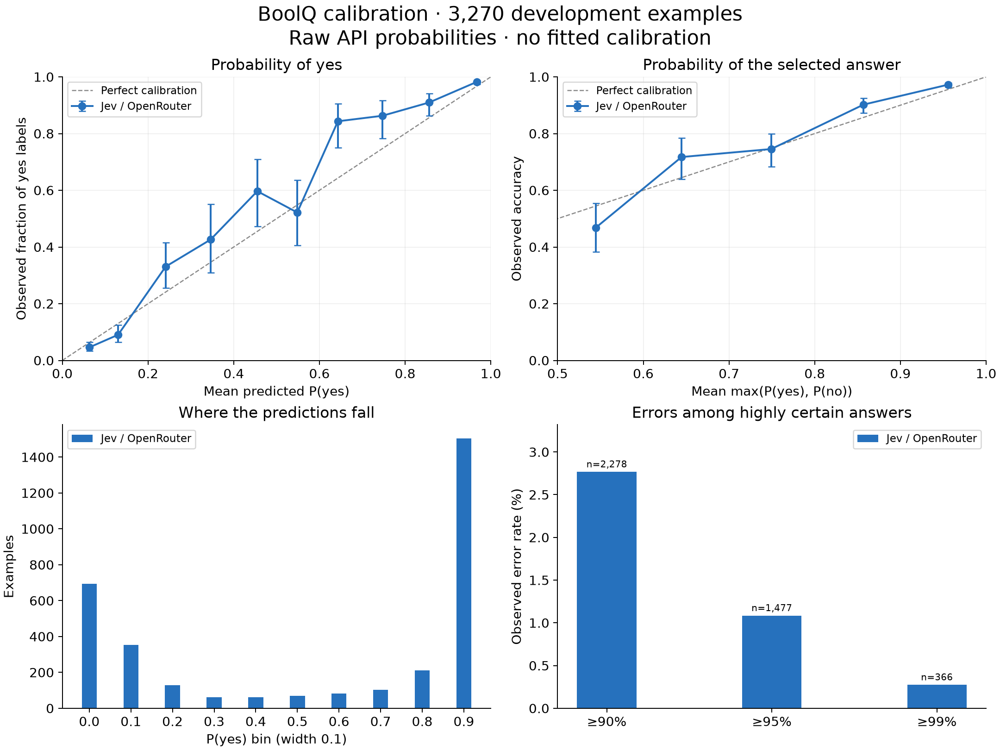

# BoolQ calibration

Evaluated 3,270 labeled development examples. Passage is the state; the yes/no question is a `noul` question. Metrics use raw returned P(yes), not the entropy confidence field. No examples were used to fit temperature or otherwise recalibrate probabilities.

| Metric | Jev / OpenRouter |
|---|---|
| Accuracy ↑ | 91.56% [90.56, 92.50] |
| Brier score ↓ | 0.0640 [0.0581, 0.0699] |
| Log loss, nats ↓ | 0.2257 [0.2092, 0.2423] |
| Mean selected-answer probability | 89.69% [89.30, 90.09] |
| Mean probability minus accuracy | -1.87% [-2.71, -0.95] |
| P(yes) ECE, 10 equal-width bins ↓ | 3.53% [2.79, 4.42] |
| Selected-answer ECE, 10 equal-width bins ↓ | 2.51% [1.89, 3.43] |

Intervals: 95% percentile bootstrap, resampling passages together (2,938 unique passages; 2,000 draws, seed 42). Paired difference intervals are in metrics.json. ECE depends on binning and has finite-sample bias; Brier/log loss also reflect predictive skill, not calibration alone. Brier is mean (P(yes) − label)². Log loss clips true-label probabilities below 1e-15. Ties at 0.5 predict yes.

Plot error bars are approximate 95% Wilson intervals within bins; the report's aggregate intervals use passage clustering.

## Highly certain errors

| Model | Probability threshold | Examples | Errors | Accuracy | Mean probability |
|---|---:|---:|---:|---:|---:|
| Jev / OpenRouter | 90% | 2278 | 63 | 97.23% | 95.55% |
| Jev / OpenRouter | 95% | 1477 | 16 | 98.92% | 97.32% |
| Jev / OpenRouter | 99% | 366 | 1 | 99.73% | 99.00% |

## Protocol and limits

- Dataset: [BoolQ](https://github.com/google-research-datasets/boolean-questions), 3,270 labeled development examples (Hugging Face validation split). The official test labels are hidden.
- Dataset revision, byte hash, exact prompt, endpoint and model are in each run's manifest.json. Predictions are resumable and indexed by dataset row.
- This is passage-grounded yes/no classification, not unrestricted factual truth or production-domain calibration. Public benchmark training overlap is unknown.
- Both endpoints receive identical payloads except model ID. Their internal prompts, model weights and inference procedures can differ.
- Completion is required: the report refuses missing or duplicate predictions.
- BoolQ is released under CC BY-SA 3.0. Raw dataset text is not checked into this repo.
- Jev / OpenRouter: response model IDs typesafe/jev-1.13-20260917; 0 requests needed retries.
- Jev / OpenRouter: reported cost for successful responses $0.0595 (excludes pilot and failed attempts).
