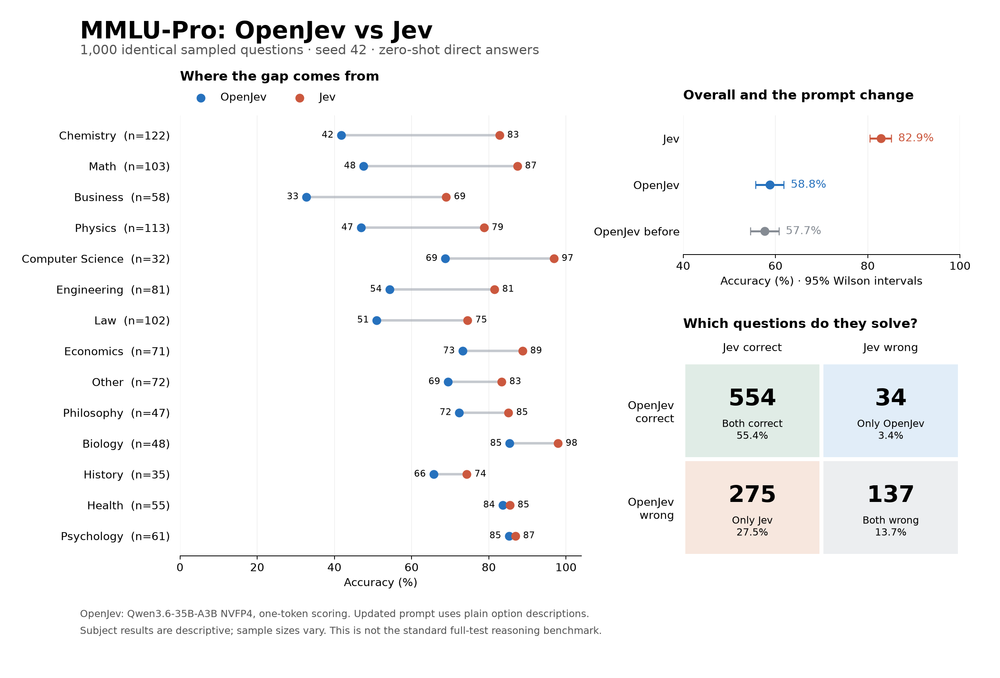

# MMLU-Pro comparison

| Model / prompt | Correct | Accuracy | 95% Wilson interval |
|---|---:|---:|---:|
| Jev | 829/1000 | 82.9% | 80.4%–85.1% |
| OpenJev | 588/1000 | 58.8% | 55.7%–61.8% |
| OpenJev before | 577/1000 | 57.7% | 54.6%–60.7% |

Jev minus updated OpenJev: **24.1 percentage points** (paired 95% bootstrap interval 21.0 to 27.2).

Both correct: 554; only Jev correct: 275; only OpenJev correct: 34; both wrong: 137.

Prompt cleanup changed OpenJev accuracy by **+1.1 points** (paired 95% bootstrap interval -0.9 to +3.1). It corrected 59 previously wrong answers and broke 48 previously correct ones.

Same question indices, gold labels, option order, and external API instructions are verified across runs. Internal models and prompts differ. The updated OpenJev prompt removes option JSON wrappers and hides keys when descriptions are supplied; null descriptions fall back to the option name. Thinking remains disabled and scoring uses one output token.

Intervals assume independent questions and omit finite-population correction. Paired differences use 10,000 bootstrap draws, seed 42. The prompt was revised after inspecting earlier results, so this is a diagnostic comparison on a reused subset, not an untouched holdout. No other inference settings were intentionally changed; batch scheduling may also cause small numerical differences.

Dataset: [MMLU-Pro](https://huggingface.co/datasets/TIGER-Lab/MMLU-Pro). This 1,000-question, zero-shot API evaluation is not a reproduction of published full-test chain-of-thought scores.
