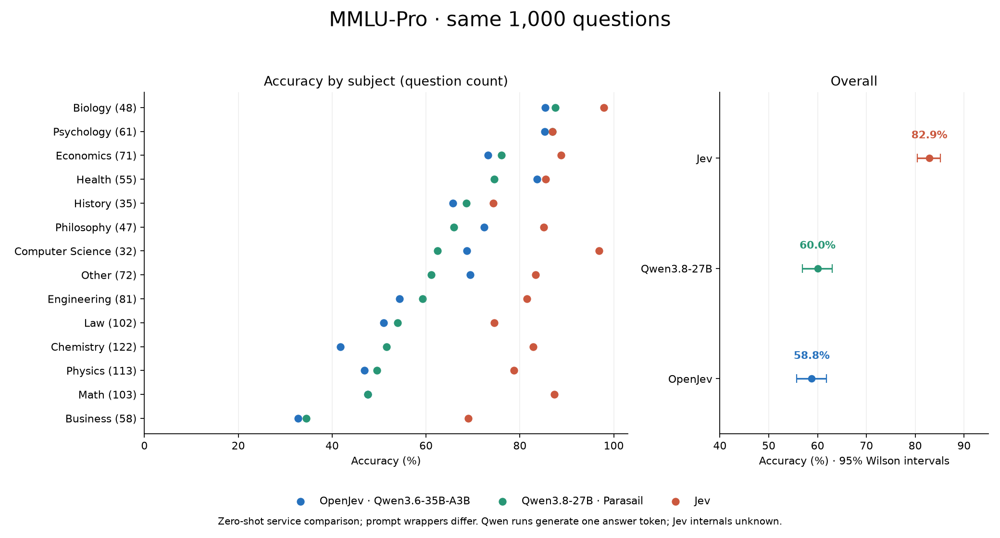

# Qwen3.8-27B: one-token MMLU-Pro

| Model/service | Correct | Accuracy | 95% Wilson CI |
|---|---:|---:|---:|
| OpenJev · Qwen3.6-35B-A3B | 588/1000 | 58.8% | 55.7%–61.8% |
| Qwen3.8-27B · Parasail | 600/1000 | 60.0% | 56.9%–63.0% |
| Jev | 829/1000 | 82.9% | 80.4%–85.1% |

Same 1000 test questions from the earlier seed-42 sample. Qwen3.8 uses zero-shot plain multiple-choice chat through OpenRouter, pinned to Parasail, thinking disabled, max_tokens=1, temperature=1, top_p=1, no logit bias. Prediction is the highest-logprob exact uppercase answer label, not the sampled token.

The services share questions and option order, but their prompt wrappers and backends differ. OpenJev uses its state/question wrapper and an answer prefix; this hosted run uses the plain prompt saved in the manifest. Jev's internal computation is unknown. This is a service comparison, not an isolated model ablation or a reproduction of five-shot chain-of-thought leaderboard scores.

Unresolved (no valid label in top-20): 0; these count wrong. All answer labels returned: 986/1000. If any valid label is returned, its argmax over valid labels is determined even when other labels are omitted. Missing probabilities are not treated as zero; no calibration metrics are computed from truncated distributions.

Reported output: 1000 tokens, 0 reasoning tokens. Successful-response cost: $0.0570. Requests with retries: 6.

qwen38_minus_openjev: +1.2 percentage points (paired bootstrap 95% interval -1.6 to +3.9; 10,000 draws, seed 42, resampled question pairs).
qwen38_minus_jev: -22.9 percentage points (paired bootstrap 95% interval -25.9 to -20.0; 10,000 draws, seed 42, resampled question pairs).

## Subject breakdown

| Subject | Questions | OpenJev | Qwen3.8 | Jev |
|---|---:|---:|---:|---:|
| biology | 48 | 85.4% | 87.5% | 97.9% |
| business | 58 | 32.8% | 34.5% | 69.0% |
| chemistry | 122 | 41.8% | 51.6% | 82.8% |
| computer science | 32 | 68.8% | 62.5% | 96.9% |
| economics | 71 | 73.2% | 76.1% | 88.7% |
| engineering | 81 | 54.3% | 59.3% | 81.5% |
| health | 55 | 83.6% | 74.5% | 85.5% |
| history | 35 | 65.7% | 68.6% | 74.3% |
| law | 102 | 51.0% | 53.9% | 74.5% |
| math | 103 | 47.6% | 47.6% | 87.4% |
| other | 72 | 69.4% | 61.1% | 83.3% |
| philosophy | 47 | 72.3% | 66.0% | 85.1% |
| physics | 113 | 46.9% | 49.6% | 78.8% |
| psychology | 61 | 85.2% | 86.9% | 86.9% |
