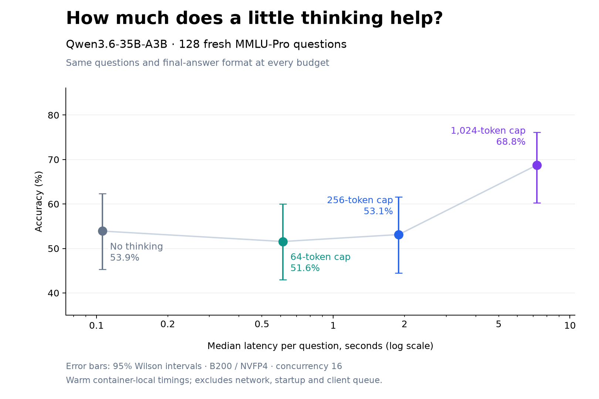

# Capped reasoning on MMLU-Pro

| Reasoning cap | Correct | Accuracy | Median latency | p95 latency | Mean reasoning tokens | Finished naturally |
|---|---:|---:|---:|---:|---:|---:|
| 0 | 69/128 | 53.9% | 0.11 s | 0.21 s | 0.0 | — |
| 64 | 66/128 | 51.6% | 0.61 s | 0.68 s | 64.0 | 0/128 |
| 256 | 68/128 | 53.1% | 1.89 s | 1.99 s | 256.0 | 0/128 |
| 1,024 | 88/128 | 68.8% | 7.25 s | 7.51 s | 984.6 | 14/128 |

Changes versus zero thinking (paired bootstrap, 10,000 draws):

- 64 tokens: -2.3 percentage points (95% interval -6.2 to +1.6).
- 256 tokens: -0.8 percentage points (95% interval -4.7 to +3.1).
- 1,024 tokens: +14.8 percentage points (95% interval +7.8 to +21.9).

The same 128 questions at all budgets; sample seed 20260919. This sample excludes the earlier 1,000-question comparison and 256-question prompt probe. Two questions were used for a mechanics pilot before the full run; there was no prompt or sampling tuning based on their accuracy.

All runs use a plain zero-shot multiple-choice prompt and JSON final-answer prefix. This differs from the production OpenJev wrapper, so compare budgets within this table, not against the earlier 58.8% result. Production was not modified.

Positive budgets enable Qwen's native thinking mode and use temperature 1, top_p 0.95, top_k 20, presence_penalty 1.5, and per-question sampling seeds. At the thinking-end token or hard budget cap, the harness closes the thinking block, appends a JSON answer prefix, and scores one answer token. It selects the highest label logprob. Test gold labels remain local. No examples or test rationales are supplied. The prompt does not explicitly coach brevity.

Budgets run separately in ascending order at concurrency 16; caching stays enabled. Later runs can benefit from earlier cached prefixes. Latency includes both internal SGLang requests but excludes external networking, startup, and the client-side concurrency queue. These are warm serving measurements, not user-facing latency guarantees. This was one sampled reasoning trace per question/budget; intervals describe question sampling and do not capture repeat-run variability. Seeds do not guarantee identical thought prefixes across budgets under different batching.

The first full attempt stopped because the harness assumed the matched thinking-end token would remain in output_ids. The Rust frontend can strip it and report it only in finish_reason. After fixing that parsing, all budgets were rerun. No partial run results enter this report. Accuracy and latency were not used to change the protocol. This is an exploratory budget comparison, not a full published-benchmark reproduction or a probability-calibration result.

[Collector](../../thinking_probe.py) · [Report script](../../report_thinking.py) · [Manifest](manifest.json) · [Metrics](metrics.json)
